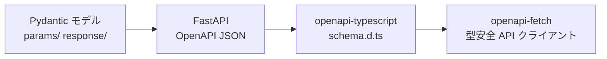

<p align="center">
  
</p>

# Josan - 産婦人科シフト管理アプリ

産婦人科クリニックにおけるスタッフのシフト管理を自動化する Web アプリケーション。
約 30 名規模のスタッフに対し、月単位でシフトを自動生成し、各種制約条件を満たしながら公平な勤務割り当てを実現する。

## 主要機能

- シフト自動生成（Google OR-Tools CP-SAT ソルバーによる制約充足最適化）
- 希望休の提出・管理
- メンバー登録・属性管理
- シフト表の表示・編集・PDF 出力

## 技術スタック

| レイヤー | 技術 |
|---|---|
| バックエンド | Python 3.14 / FastAPI / SQLAlchemy / Alembic |
| フロントエンド | React 19 / TypeScript 5.9 / Vite 7 / Tailwind CSS v4 |
| UI コンポーネント | shadcn/ui / Radix UI / Lucide Icons |
| シフト生成エンジン | Google OR-Tools CP-SAT ソルバー |
| DB | MySQL 8 |
| パッケージ管理 | uv (backend) / npm (frontend) |
| タスクランナー | [mise](https://mise.jdx.dev/) |
| コンテナ | Docker Compose |

## ディレクトリ構成

```
├── backend/
│   ├── entity/        # SQLAlchemy モデル
│   ├── routers/       # API エンドポイント
│   ├── params/        # リクエストスキーマ (Pydantic)
│   ├── response/      # レスポンススキーマ (Pydantic)
│   ├── solver/        # シフト生成ソルバー
│   ├── pdf/           # PDF 出力
│   ├── db/            # DB 接続設定
│   └── alembic/       # マイグレーション
├── frontend/
│   └── src/
│       ├── api/       # API クライアント・型定義
│       ├── components/
│       ├── pages/
│       ├── hooks/
│       └── layouts/
├── docs/              # 仕様書
└── compose.yaml
```

## セットアップ

### 必要なもの

- [mise](https://mise.jdx.dev/) — Python, uv のバージョン管理 & タスクランナー
- [Docker](https://www.docker.com/) & Docker Compose

### 手順

```bash
# 1. ツールのインストール (Python 3.14 + uv)
mise install

# 2. 全サービス起動 (API:8000, Frontend:5173, MySQL:3309)
docker compose up -d

# 3. DB マイグレーション
mise run migrate
```

起動後のアクセス先:

- **Frontend**: http://localhost:5173
- **API**: http://localhost:8000
- **API ドキュメント**: http://localhost:8000/docs

## 開発コマンド

| コマンド | 説明 |
|---|---|
| `docker compose up -d` | 全サービス起動 |
| `mise run dev` | バックエンド開発サーバー |
| `mise run dev:front` | フロントエンド開発サーバー |
| `mise run migrate` | マイグレーション実行 |
| `mise run migrate-gen message="xxx"` | マイグレーション生成 |
| `mise run lint` | バックエンド lint (Ruff + mypy) |
| `mise run lint:front` | フロントエンド lint (ESLint + tsc) |
| `mise run lint:all` | 全体 lint |
| `mise run format` | バックエンド フォーマット (Ruff) |
| `mise run format:front` | フロントエンド lint fix (ESLint) |
| `mise run generate-api` | OpenAPI → TypeScript 型生成 (要 API サーバー起動) |
| `mise run build:front` | フロントエンド本番ビルド |

## API 型生成フロー

バックエンドの Pydantic スキーマからフロントエンドの型安全な API クライアントまで、自動生成のパイプラインで接続している。



```bash
# API サーバー起動中に実行
mise run generate-api
```

生成されるファイル:

| ファイル | 役割 |
|---|---|
| `frontend/src/api/schema.d.ts` | openapi-typescript が生成する型定義（自動生成・編集不可） |
| `frontend/src/api/constants.ts` | schema.d.ts からの型エイリアス・ラベルマップ |
| `frontend/src/api/fetcher.ts` | openapi-fetch を使った型安全な API クライアント |

## ドキュメント

| ファイル | 内容 |
|---|---|
| [00_概要.md](docs/00_概要.md) | プロジェクト概要と技術スタック |
| [01_データモデル.md](docs/01_データモデル.md) | テーブル定義、ENUM 値、ER 図 |
| [02_配置ルール.md](docs/02_配置ルール.md) | 日別配置パターン、公休日数、希望休ルール |
| [03_シフト生成アルゴリズム.md](docs/03_シフト生成アルゴリズム.md) | ソルバー設定、制約条件、求解戦略 |
| [04_アプリケーション仕様.md](docs/04_アプリケーション仕様.md) | 画面一覧、各画面の仕様、PDF 出力 |
| [05_カラーパレット.md](docs/05_カラーパレット.md) | ブランドカラー、セマンティック色、シフト色 |
